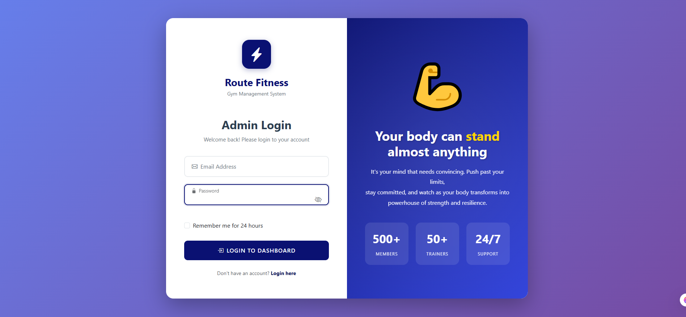
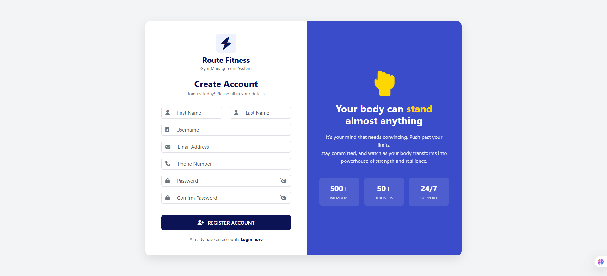
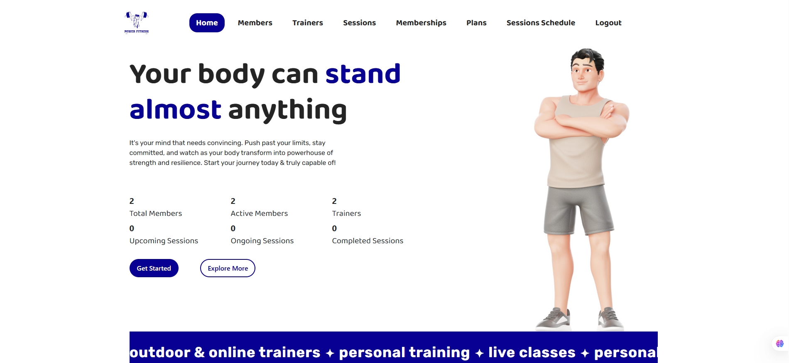
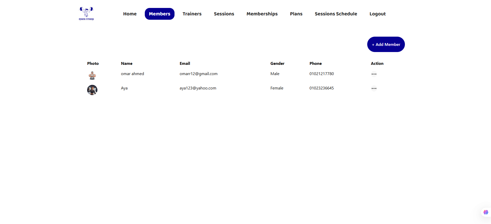
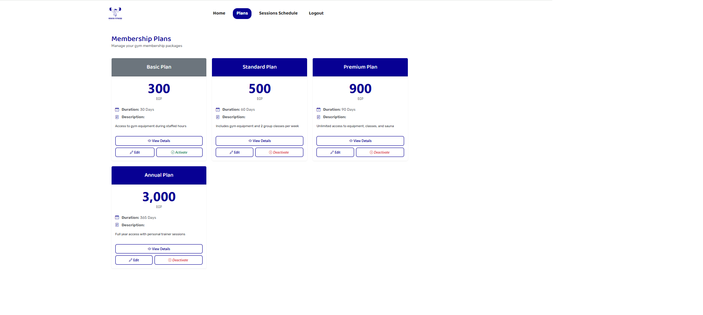
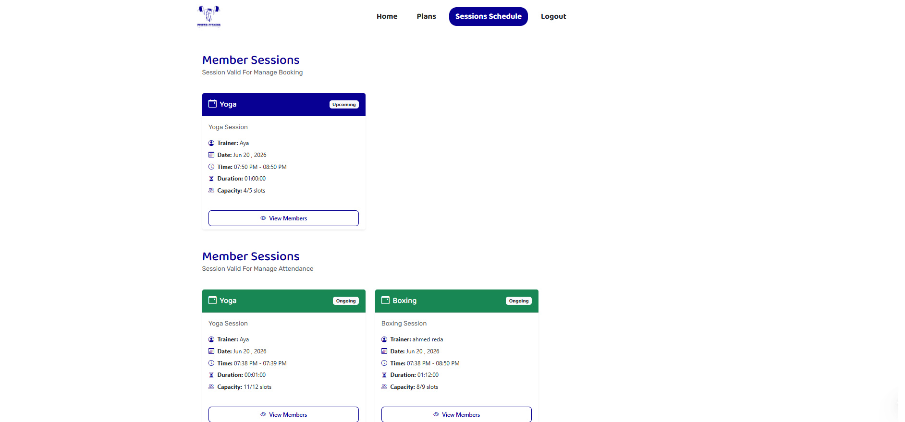
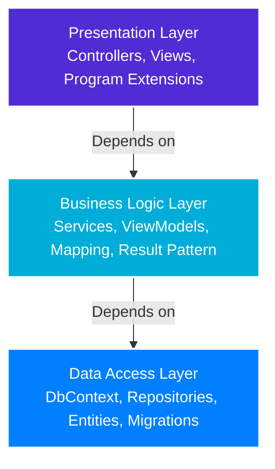
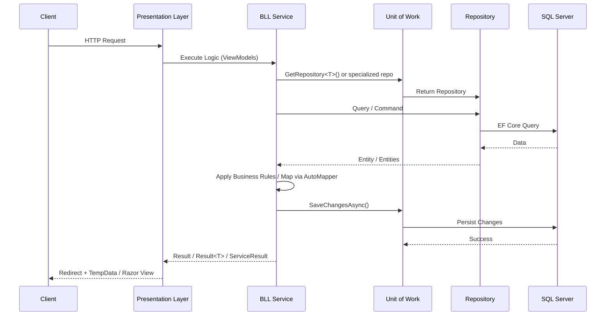
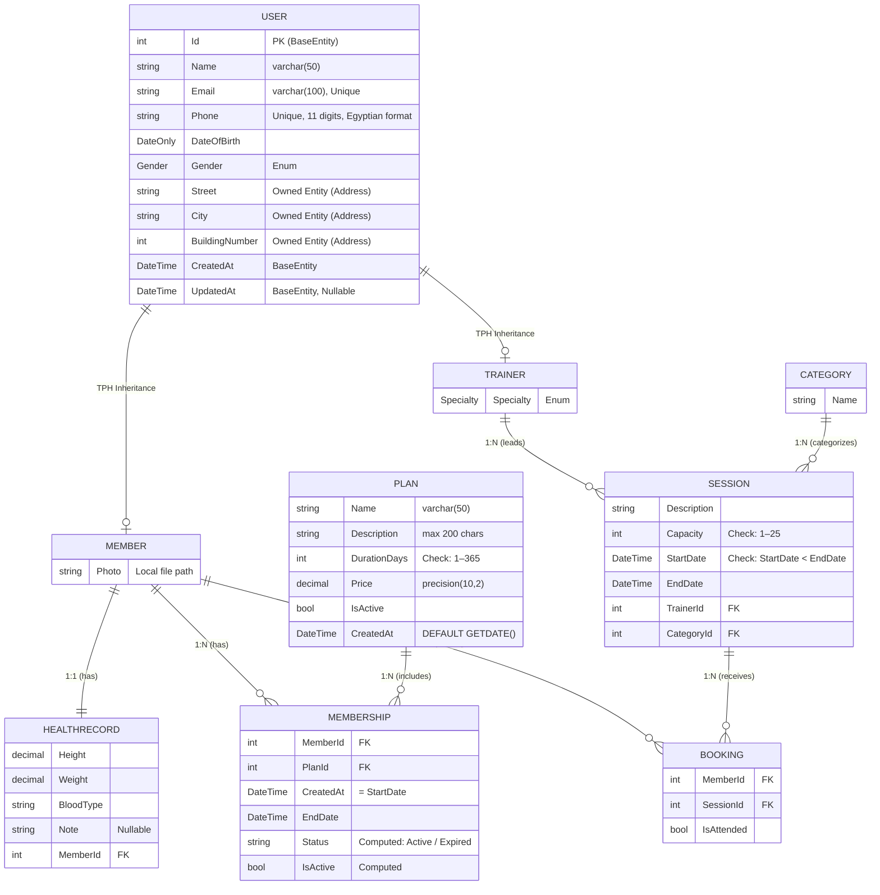

# 🏋️ Gym Management System

A comprehensive ASP.NET Core MVC application for managing gym operations, built with a clean 3-Layer Architecture (PL / BLL / DAL), Generic Repository & Unit of Work patterns, ASP.NET Core Identity, and AutoMapper.

[](https://dotnet.microsoft.com/)
[](https://docs.microsoft.com/en-us/ef/core/)
[](https://automapper.org/)
[](https://learn.microsoft.com/en-us/aspnet/core/security/authentication/identity)
[](#license)

---

## 📋 Table of Contents

- [Project Overview](#-project-overview)
- [Features](#-features)
- [Application Screenshots](#-application-screenshots)
- [Architecture](#-architecture)
- [Technology Stack](#-technology-stack)
- [Project Structure](#-project-structure)
- [Core Implementation Details](#-core-implementation-details)
  - [1. Three-Layer Architecture](#1-three-layer-architecture)
  - [2. Generic Repository & Unit of Work](#2-generic-repository--unit-of-work)
  - [3. Result Pattern](#3-result-pattern)
  - [4. AutoMapper Mapping Profile](#4-automapper-mapping-profile)
  - [5. ASP.NET Core Identity & Role-Based Authorization](#5-aspnet-core-identity--role-based-authorization)
  - [6. File Attachment Service](#6-file-attachment-service)
  - [7. Business Rules Enforcement](#7-business-rules-enforcement)
  - [8. Data Seeding](#8-data-seeding)
- [Database Schema](#-database-schema)
- [Getting Started](#-getting-started)
  - [Prerequisites](#prerequisites)
  - [Installation](#installation)
- [Usage](#-usage)
- [Configuration](#-configuration)
- [Development Guidelines](#-development-guidelines)
- [Testing](#-testing)
- [Contributing](#-contributing)
- [License](#-license)
- [Contact / Author](#-contact--author)

---

## 🎯 Project Overview

The Gym Management System is a web application designed to streamline gym operations including member management, trainer scheduling, session bookings, and membership plans. The system implements established software engineering patterns such as the Unit of Work, Generic Repository, and Result patterns, combined with a set of real-world business rules enforced at the service layer.

---

## ✨ Features

- **Member Management**: Track member profiles, photos (local upload), health records, and membership status.
- **Trainer Management**: Manage trainer profiles, specializations, and assigned sessions.
- **Session Scheduling**: Create and manage training sessions with capacity limits, booking, and attendance tracking.
- **Membership Plans**: Define flexible plans with pricing, duration, and an activation toggle.
- **Category Management**: Organize sessions by categories (matched to trainer specialties).
- **Booking System**: Assign members to upcoming sessions, cancel bookings, and mark attendance for ongoing sessions.
- **Dashboard Analytics**: Real-time counters for members, active memberships, trainers, and sessions across different states.
- **Role-Based Authorization**: Distinct access levels for SuperAdmin, Admin, and User via ASP.NET Core Identity.

---

## 📸 Application Screenshots

### 🛡️ Authentication
<div align="center">
  
  
</div>

### 👑 Admin Views
<div align="center">
  
  
</div>

### 🏋️ Member Views
<div align="center">
  
  
</div>

*(Screenshots are loaded from the `photos/` directory at the solution root.)*

---

## 🏗️ Architecture

### Clean 3-Layer Architecture

The application follows a strict **3-layer architecture** with clear separation of concerns:



### Request Flow

The system employs a clear request flow leveraging the Result pattern for robust operation outcomes:



### Layer Responsibilities

#### **Presentation Layer** (`GymManagment.PL`)
- ASP.NET Core MVC controllers and Razor views
- User interface and HTTP request handling
- Role-based access control via `[Authorize]` attributes
- `ProgramExtentions.cs` for auto-migration and seeding at startup
- Static assets (`wwwroot/`) including seed data JSON files

#### **Business Logic Layer** (`GymManagment.BLL`)
- Service interfaces and implementations per domain
- AutoMapper `MappingProfile` for entity ↔ ViewModel mapping
- `AttachmentService` for local file upload / download / delete
- ViewModels organized per domain area
- Result pattern (`Result`, `Result<T>`, `ServiceResult`) for operation outcomes
- All business rules enforced here — **never in the controllers**

#### **Data Access Layer** (`GymManagment.DAL`)
- Entity Framework Core `GymDbContext` (inherits `IdentityDbContext<ApplicationUser>`)
- Domain entities with Fluent API configurations (separate class per entity)
- Generic Repository and specialized repositories (Session, Booking, MemberShip, Member)
- Unit of Work with repository caching
- Data seeding (Plans from JSON, Identity roles and admin users)
- EF Core migrations

---

## 🛠️ Technology Stack

| Category | Technology | Version |
|---|---|---|
| Framework | .NET / ASP.NET Core MVC | 9.0 |
| Language | C# | 13 |
| ORM | Entity Framework Core (SQL Server) | 9.0.16 |
| Authentication | ASP.NET Core Identity | 9.0.17 |
| Object Mapping | AutoMapper | 16.1.1 |
| Dependency Injection | Built-in Microsoft DI | — |
| Database | SQL Server | LocalDB / Express / Full |

---

## 📁 Project Structure

```text
GymManagmentSolution/
│
├── GymManagment/                                # Presentation Layer (PL)
│   ├── Controllers/
│   │   ├── AccountController.cs                 # Login, Register, Logout
│   │   ├── MembersController.cs                 # [SuperAdmin] Member CRUD + Photo
│   │   ├── TrainersController.cs                # Trainer CRUD
│   │   ├── SessionsController.cs                # [SuperAdmin,Admin] Session CRUD
│   │   ├── PlansController.cs                   # Plan edit + activate/deactivate
│   │   ├── BookingsController.cs                # [Authorize] Booking + Attendance
│   │   ├── MemberShipsController.cs             # Membership create/delete
│   │   └── HomeController.cs                    # Dashboard analytics
│   ├── Views/                                   # Razor Views (per controller)
│   ├── Models/
│   │   └── ErrorViewModel.cs
│   ├── MembersPhoto/                            # Uploaded member photos (local)
│   ├── wwwroot/
│   │   └── Files/
│   │       └── plans.json                       # Seed data for plans
│   ├── Program.cs                               # DI registrations and pipeline
│   ├── ProgramExtentions.cs                     # Auto-migration & seeding
│   ├── appsettings.json
│   └── appsettings.Development.json
│
├── GymManagment.BLL/                            # Business Logic Layer (BLL)
│   ├── Services/
│   │   ├── Interfaces/                          # Service contracts
│   │   ├── Classes/                             # Service implementations
│   │   └── Attachment/                          # IAttachmentService + AttachmentService
│   ├── ViewModels/                              # Organized per domain
│   │   ├── AccountViewModels/
│   │   ├── MemberViewModels/
│   │   ├── TrainerViewModels/
│   │   ├── SessionViewModels/
│   │   ├── PlanViewModels/
│   │   ├── BookingViewModels/
│   │   ├── MemberShipViewModels/
│   │   └── DashboardViewModels/
│   ├── Common/
│   │   ├── Result.cs                            # Result & Result<T>
│   │   ├── ResultKind.cs                        # OK, NotFound, Conflict, ValidationFailed, Forbidden
│   │   └── ServiceResult.cs                     # Field-level validation result
│   └── MappingProfile.cs                        # AutoMapper profile
│
├── GymManagment.DAL/                            # Data Access Layer (DAL)
│   ├── Data/
│   │   ├── DbContexts/
│   │   │   └── GymDbContext.cs                  # IdentityDbContext<ApplicationUser>
│   │   ├── Configurations/                      # Fluent API (one class per entity)
│   │   ├── Models/                              # Domain entities + Enums
│   │   └── DataSeeding/                         # GymDataSeeding + IdentityDataSeeding
│   ├── Migrations/
│   └── Repositories/
│       ├── Interfaces/                          # IGenericRepository, IUnitOfWork, specialized
│       └── Classes/                             # GenericRepository, UnitOfWork, specialized
│
├── photos/                                      # Application screenshots for README
│   ├── login.png
│   ├── register.png
│   ├── admin-dashboard.png
│   ├── admin-member-page.png
│   ├── member-plans.png
│   └── member-view-schedule-page.png
│
└── GymManagmentSolution.sln
```

---

## 🔧 Core Implementation Details

### 1. Three-Layer Architecture

#### Layer Separation via Project References

**Presentation Layer** (`GymManagment.PL.csproj`) — references BLL only:
```xml
<ItemGroup>
  <ProjectReference Include="..\GymManagment.BLL\GymManagment.BLL.csproj" />
</ItemGroup>
```

**Business Logic Layer** (`GymManagment.BLL.csproj`) — references DAL:
```xml
<ItemGroup>
  <ProjectReference Include="..\GymManagment.DAL\GymManagment.DAL.csproj" />
  <PackageReference Include="AutoMapper" Version="16.1.1" />
  <FrameworkReference Include="Microsoft.AspNetCore.App" />
</ItemGroup>
```

**Data Access Layer** (`GymManagment.DAL.csproj`) — no project references, only NuGet packages:
```xml
<ItemGroup>
  <PackageReference Include="Microsoft.AspNetCore.Identity.EntityFrameworkCore" Version="9.0.17" />
  <PackageReference Include="Microsoft.EntityFrameworkCore.SqlServer" Version="9.0.16" />
  <PackageReference Include="Microsoft.EntityFrameworkCore.Tools" Version="9.0.15" />
</ItemGroup>
```

#### Dependency Flow
- **PL → BLL → DAL** (strict top-down; no layer skips)
- DAL has zero project dependencies — only NuGet packages

---

### 2. Generic Repository & Unit of Work

#### Generic Repository Interface

```csharp
public interface IGenericRepository<TEntity> where TEntity : BaseEntity, new()
{
    Task<IEnumerable<TEntity>> GetAllAsync(bool tracking = false, CancellationToken ct = default);
    Task<IEnumerable<TEntity>> GetAllAsync(
        Expression<Func<TEntity, bool>> predicate,
        bool tracking = false, CancellationToken ct = default);
    Task<TEntity?> GetByIdAsync(int id, CancellationToken ct = default);
    void Add(TEntity entity);
    void Update(TEntity entity);
    void Delete(TEntity entity);
    Task<bool> ExistsAsync(Expression<Func<TEntity, bool>> predicate, CancellationToken ct = default);
    Task<TEntity?> FirstOrDefaultAsync(Expression<Func<TEntity, bool>> predicate,
        bool tracking = false, CancellationToken ct = default);
    Task<int> CountAsync(Expression<Func<TEntity, bool>>? predicate = null, CancellationToken ct = default);
}
```

#### Unit of Work with Repository Caching

```csharp
public class UnitOfWork : IUnitOfWork
{
    private readonly Dictionary<string, object> _repositories = [];
    private readonly GymDbContext _dbContext;

    // Specialized repositories injected via constructor
    public ISessionRepository SessionRepository { get; }
    public IMemberShipRepository MemberShipRepository { get; }
    public IBookingRepository BookingRepository { get; }
    public IMemberRepository MemberRepository { get; }

    public IGenericRepository<TEntity> GetRepository<TEntity>() where TEntity : BaseEntity, new()
    {
        var typeName = typeof(TEntity).Name;
        if (_repositories.TryGetValue(typeName, out object? value))
            return (IGenericRepository<TEntity>)value;

        var repo = new GenericRepository<TEntity>(_dbContext);
        _repositories[typeName] = repo;
        return repo;
    }

    public async Task<int> SaveChangesAsync(CancellationToken ct = default)
        => await _dbContext.SaveChangesAsync(ct);
}
```

**Benefits:**
- ✅ **DRY** — CRUD operations defined once, reused across all entities
- ✅ **Caching** — Repository instances reused within the same request scope
- ✅ **Flexibility** — Specialized repositories for complex queries with `Include()`
- ✅ **Testability** — Interface-based design enables easy mocking

---

### 3. Result Pattern

```csharp
// Non-generic: for commands that only signal success/failure
public sealed record Result(bool success, string? error = null, ResultKind kind = ResultKind.OK)
{
    public static Result OK()                              => new Result(success: true);
    public static Result Fail(string error, ...)          => new(false, error, kind);
    public static Result NotFound(string error = "...")   => new(false, error, ResultKind.NotFound);
    public static Result Validation(string error)         => new(false, error, ResultKind.ValidationFailed);
}

// Generic: for queries that return a value on success
public sealed record Result<T>(bool success, T? value, string? error = null, ResultKind kind = ResultKind.OK)
{
    public static Result<T> OK(T value) => new Result<T>(true, value);
    // ...
}
```

`ServiceResult` carries a `Dictionary<string, string>` of `field → error` pairs for direct `ModelState` mapping — used specifically in Trainer flows.

---

### 4. AutoMapper Mapping Profile

All mappings are centralized in `MappingProfile.cs` in the BLL project:

```csharp
public class MappingProfile : Profile
{
    public MappingProfile()
    {
        MapMember();    // Member ↔ ViewModels, Address flattening, active membership resolution
        MapSession();   // Session ↔ ViewModels, Trainer/Category includes
        MapPlan();      // Plan ↔ UpdatePlanViewModel (name update blocked by business rule)
        MapMemberShip(); // Membership ↔ MemberShipViewModel
    }
}
```

---

### 5. ASP.NET Core Identity & Role-Based Authorization

```csharp
builder.Services.AddIdentity<ApplicationUser, IdentityRole>(config =>
{
    config.User.RequireUniqueEmail = true;
    config.Lockout.DefaultLockoutTimeSpan = TimeSpan.FromMinutes(1);
    config.Lockout.MaxFailedAccessAttempts = 5;
    config.Password.RequireNonAlphanumeric = false;
})
.AddEntityFrameworkStores<GymDbContext>();

builder.Services.ConfigureApplicationCookie(opt =>
{
    opt.ExpireTimeSpan = TimeSpan.FromDays(7);
});
```

| Controller | Role Requirement |
|---|---|
| `MembersController` | `[Authorize(Roles = "SuperAdmin")]` |
| `SessionsController` | `[Authorize(Roles = "SuperAdmin,Admin")]` |
| `BookingsController` | `[Authorize]` (any authenticated user) |
| `HomeController` | `[Authorize]` (any authenticated user) |

---

### 6. File Attachment Service

```csharp
public class AttachmentService : IAttachmentService
{
    private readonly long _maxFileSize = 5 * 1024 * 1024; // 5 MB
    private readonly string[] _allowedExtensions = [".jpeg", ".png", ".jpg"];

    public async Task<Result<string>> UploadAsync(
        Stream fileStream, string fileName, string folderName, CancellationToken ct = default)
    {
        // Validates: stream readable, size <= 5MB, extension in allowed list
        // Generates: {Guid.NewGuid()}{originalFileName} to prevent collisions
        // Stores in: ContentRootPath / folderName / uniqueFileName
        return Result<string>.OK(storedFileName);
    }
}
```

> **Rollback consistency**: If the database save fails after a successful photo upload, the uploaded file is deleted immediately to avoid orphaned files on disk.

---

### 7. Business Rules Enforcement

All business rules are enforced at the **BLL service layer**, not in controllers.

#### Sessions
| Rule | Enforced In |
|---|---|
| End date must be after start date | `SessionService.CreateSessionAsync` |
| Start date must be in the future | `SessionService.CreateSessionAsync` |
| Capacity must be between 1 and 25 | `SessionService.CreateSessionAsync` |
| Trainer specialty must match session category | `SessionService.CreateSessionAsync / UpdateSessionAsync` |
| Cannot edit a session that has already started | `SessionService.GetSessionToUpdate` |
| Cannot edit a session that has existing bookings | `SessionService.GetSessionToUpdate` |
| Cannot delete a session that has not ended yet | `SessionService.RemoveSessionAsync` |

#### Plans
| Rule | Enforced In |
|---|---|
| Cannot update an inactive plan | `PlanService.GetPlanToUpdateAsync` |
| Cannot update a plan with active memberships | `PlanService.UpdatePlanAsync` |
| Cannot deactivate a plan with active memberships | `PlanService.ToggleActivationAsync` |

#### Bookings
| Rule | Enforced In |
|---|---|
| Session must not have started yet | `BookingService.CreateNewBookingAsync` |
| Member must have an active membership | `BookingService.CreateNewBookingAsync` |
| Member cannot book the same session twice | `BookingService.CreateNewBookingAsync` |
| Session must not be at full capacity | `BookingService.CreateNewBookingAsync` |
| Cannot cancel a booking after the session starts | `BookingService.CancelBookingAsync` |

#### Members
| Rule | Enforced In |
|---|---|
| Email and phone must be unique | `MemberService.CreateMemberAsync / UpdateMemberDetailsAsync` |
| Cannot delete a member with future session bookings | `MemberService.RemoveMemberAsync` |

---

### 8. Data Seeding

Migrations and seeding run automatically on startup via `MigrateAndSeedDatabaseAsync`:

```csharp
// 1. Apply any pending EF Core migrations automatically
var pendingMigrations = await dbContext.Database.GetPendingMigrationsAsync();
if (pendingMigrations.Any())
    await dbContext.Database.MigrateAsync();

// 2. Seed Plans from wwwroot/Files/plans.json (only if the table is empty)
await GymDataSeeding.SeedPlansAsync(dbContext, seedFolderPath, logger);

// 3. Seed Identity: roles + default admin users (only if no users exist yet)
await IdentityDataSeediong.SeedIdentityDataAsync(roleManager, userManager, logger);
```

---

## 🗄️ Database Schema

### Core Entities



> **Note**: `ApplicationUser` inherits from `IdentityUser` and lives in the standard ASP.NET Identity tables, separate from the domain `User → Member / Trainer` TPH hierarchy.

---

## 🚀 Getting Started

### Prerequisites

- [.NET 9.0 SDK](https://dotnet.microsoft.com/download/dotnet/9.0)
- [SQL Server](https://www.microsoft.com/en-us/sql-server/sql-server-downloads) (LocalDB, Express, or Full)
- [Visual Studio 2022](https://visualstudio.microsoft.com/) or [VS Code](https://code.visualstudio.com/)

### Installation

1. **Clone the repository**
   ```bash
   git clone <repository-url>
   cd GymManagmentSolution
   ```

2. **Restore NuGet packages**
   ```bash
   dotnet restore
   ```

3. **Configure the connection string**

   Edit `GymManagment/appsettings.Development.json`:
   ```json
   {
     "ConnectionStrings": {
       "DefaultConnection": "Server=.;Database=GymManagmentdb;Trusted_Connection=true;TrustServerCertificate=true"
     }
   }
   ```

   Alternatively, use **User Secrets** to keep credentials out of source control:
   ```bash
   cd GymManagment
   dotnet user-secrets init
   dotnet user-secrets set "ConnectionStrings:DefaultConnection" "Server=.;Database=GymManagmentdb;Trusted_Connection=true;TrustServerCertificate=true"
   ```

4. **Run the application**

   Database migrations and seeding run automatically at startup — no manual `dotnet ef` commands needed.
   ```bash
   dotnet run --project GymManagment
   ```

5. **Access the application**

   Navigate to `https://localhost:5001` (or the port shown in the console). The app redirects to the Login page by default.

---

## 💻 Usage

Once running, log in using one of the seeded accounts to explore the system:

### 🔑 Seeded Accounts
| Role | Name (First + Last) | Username | Email | Password |
|---|---|---|---|---|
| **SuperAdmin** | Super Admin | `superAdmin` | `superadmin@gmail.com` | *[See IdentityDataSeediong.cs]* |
| **Admin** | admin | `admin` | `admin@gmail.com` | *[See IdentityDataSeediong.cs]* |

> ⚠️ **Security Note**: The default admin credentials are seeded automatically on first run. **Change these passwords immediately in a production environment.**

The application will be available at: `https://localhost:5001`

| Controller Area | Access Level |
|---|---|
| Dashboard (Home) | Any authenticated user |
| Sessions | SuperAdmin, Admin |
| Members | SuperAdmin only |
| Trainers | Any authenticated user |
| Plans | Any authenticated user |
| Bookings | Any authenticated user |
| Memberships | Any authenticated user |

---

## ⚙️ Configuration

### Connection String

Configured via `ConnectionStrings:DefaultConnection` in `appsettings.Development.json` or via User Secrets.

**Development** (recommended via User Secrets):
```bash
dotnet user-secrets set "ConnectionStrings:DefaultConnection" "Server=.;Database=GymManagmentdb;Trusted_Connection=true;TrustServerCertificate=true"
```

**Production** (via Environment Variables):
```bash
# Windows (PowerShell)
$env:ConnectionStrings__DefaultConnection = "Server=prod-server;Database=GymManagmentdb;User Id=sa;Password=<your-password>;"

# Linux / macOS
export ConnectionStrings__DefaultConnection="Server=prod-server;Database=GymManagmentdb;User Id=sa;Password=<your-password>;"
```

### Identity & Cookie Settings

Configured in `Program.cs`:

| Setting | Value |
|---|---|
| Unique Email | Required |
| Cookie Expiry | 7 days |
| Account Lockout | 5 failed attempts → 1 minute lockout |
| Non-Alphanumeric Password | Not required |

---

## 📚 Development Guidelines

### Adding a New Entity

1. **Create entity class** in `GymManagment.DAL/Data/Models/`
   ```csharp
   public class Equipment : BaseEntity
   {
       public string Name { get; set; } = default!;
       public string Description { get; set; } = default!;
   }
   ```

2. **Create EF configuration** in `GymManagment.DAL/Data/Configurations/`
   ```csharp
   public class EquipmentConfigurations : IEntityTypeConfiguration<Equipment>
   {
       public void Configure(EntityTypeBuilder<Equipment> builder)
       {
           builder.Property(e => e.Name).HasMaxLength(100);
       }
   }
   ```
   > Configurations are auto-applied via `modelBuilder.ApplyConfigurationsFromAssembly(...)` in `GymDbContext` — no manual registration needed.

3. **Add DbSet** to `GymDbContext`
   ```csharp
   public DbSet<Equipment> Equipment { get; set; } = default!;
   ```

4. **Create and apply migration**
   ```bash
   dotnet ef migrations add AddEquipment --project GymManagment.DAL --startup-project GymManagment
   dotnet ef database update --project GymManagment.DAL --startup-project GymManagment
   ```

### Adding a New Service

1. **Define interface** in `GymManagment.BLL/Services/Interfaces/`
   ```csharp
   public interface IEquipmentService
   {
       Task<Result<IEnumerable<EquipmentViewModel>>> GetAllAsync(CancellationToken ct = default);
       Task<Result> CreateAsync(CreateEquipmentViewModel model, CancellationToken ct = default);
   }
   ```

2. **Implement service** in `GymManagment.BLL/Services/Classes/`
   ```csharp
   public class EquipmentService : IEquipmentService
   {
       private readonly IUnitOfWork _unitOfWork;
       private readonly IMapper _mapper;

       public EquipmentService(IUnitOfWork unitOfWork, IMapper mapper)
       {
           _unitOfWork = unitOfWork;
           _mapper = mapper;
       }
       // Implementation...
   }
   ```

3. **Register in `Program.cs`**
   ```csharp
   builder.Services.AddScoped<IEquipmentService, EquipmentService>();
   ```

4. **Add mappings** to `MappingProfile.cs`
   ```csharp
   CreateMap<Equipment, EquipmentViewModel>();
   CreateMap<CreateEquipmentViewModel, Equipment>();
   ```

---

## 🧪 Testing

There are currently no automated test projects (Unit/Integration tests) included in the solution.

*(If tests are added in the future, run them with `dotnet test`.)*

---

## 🤝 Contributing

Contributions are welcome! To contribute:

1. Fork the repository.
2. Create a new branch for your feature or bugfix (`git checkout -b feature/your-feature-name`).
3. Commit your changes (`git commit -m "Add some feature"`).
4. Push to the branch (`git push origin feature/your-feature-name`).
5. Open a Pull Request.

Please ensure your code:
- Adheres to the existing **3-layer architecture** (PL → BLL → DAL)
- Follows the **Generic Repository / Unit of Work** patterns
- Enforces all **business rules in the service layer**, not in controllers
- Returns **`Result<T>`** or **`ServiceResult`** from services

---

## 📄 License

**TBD**

*(Placeholder: Specify your license here, e.g., MIT, GPL, etc. Add a `LICENSE` file to the root directory.)*

---

## 📬 Contact / Author

- **Name**: Ahmed Reda
- **Email**: ahmedreda7798@gmail.com
- **GitHub**: [ahmedreda7798](https://github.com/ahmedreda7798)

---

## 🙏 Acknowledgments

- 3-Layer Architecture best practices
- Entity Framework Core documentation and best practices
- ASP.NET Core Identity documentation
- AutoMapper community and documentation
- Repository & Unit of Work patterns

---

**Built with ❤️ using .NET 9 and Clean 3-Layer Architecture**
